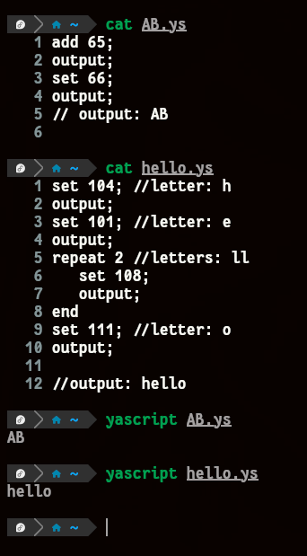
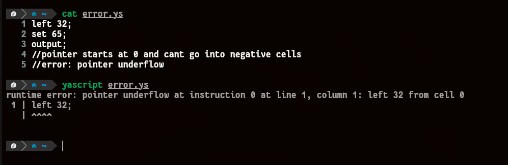
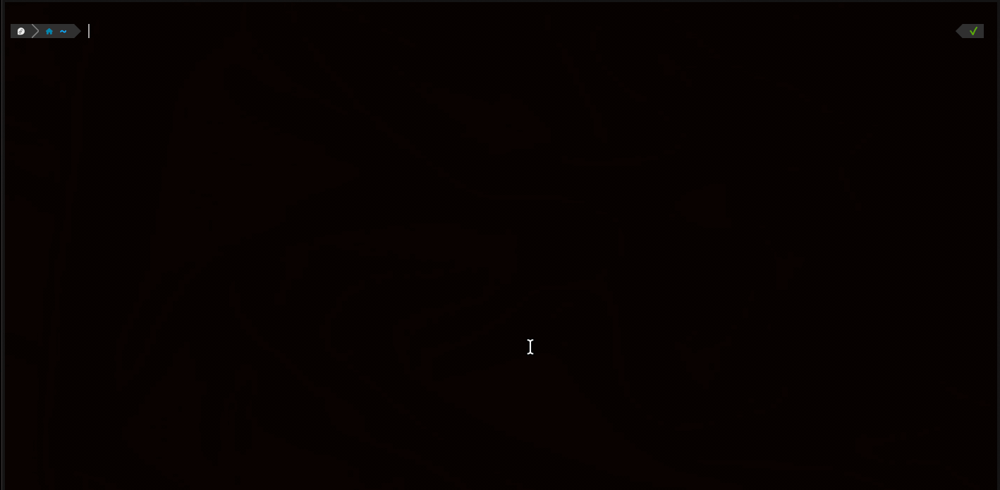

# yascript - Fast Tape Interpreter
A blazingly fast interpreter for Brainfuck-like esoteric language with a modern command set.

## Features

- **Fast**: Optimized build (`-O3`), optional CPU-specific optimization via `make NATIVE=1`
- **Modern Syntax**: Readable command names (no `>` and `<`, no `+` and `-`)
- **Loop Syntax**: Ruby-inspired `repeat N ... end` blocks instead of `[` and `]`
- **Execution Pipeline**:
  1. Tokenization
  2. Parsing
  3. Multi-pass optimization
  4. Direct execution of optimized instructions
  5. Buffered output (4KB)

## Project structure

```
yascript/
├── src/         # Interpreter implementation
├── include/     # Header files
├── examples/    # Example .ys programs
├── tests/       # Test suite
├── docs/        # Design and optimization documentation
├── Makefile     # Build system
└── README.md
```
  
## Install Scripts

 - Install:
```bash
./install.sh
```
 - Uninstall:
```bash
./uninstall.sh
```

# NOTE: Requires: g++ with C++23 support (recent GCC/Clang)

## Usage

### Command-line

Run inline code:
```bash
./yascript -e "repeat 72 add; end; output;"
```

Run from a `.ys` file:
```bash
./yascript hello.ys
```

### Commands
| Command      | Syntax        | Description                              |
|--------------|---------------|------------------------------------------|
| Move left    | `left [N]`    | Move pointer N cells left (default 1)    |
| Move right   | `rght [N]`    | Move pointer N cells right (default 1)   |
| Increment    | `add [N]`     | Add N to current cell (default 1)        |
| Decrement    | `sub [N]`     | Subtract N from current cell (default 1) |
| Set value    | `set N`       | Set current cell to N                    |
| Direct Seek  | `goto TARGET` | Seek tape pointer directly to cell TARGET|
| Output       | `output`      | Output current cell as ASCII             |
| Input        | `read`        | Read one byte to current cell            |
| Print number | `print`       | Output current cell as decimal number    |
| Zero cell    | `zero`        | Set current cell to 0                    |
| Loop start   | `repeat N`    | Start loop, repeat N times               |
| Loop end     | `end`         | End loop block                           |

## Examples





<h2 align="center">Demo</h2>

<p align="center">
  
</p>

## Language Properties

- Tape: Unlimited dynamically-expanding tape (zero-initialized)
- Cells: 64-bit unsigned integers (uint64_t)
- Comments: `#` and `//`
- Extension: `.ys`

## Quick Start

```bash
./yascript test.ys
```

Output: `A`

## Building

```bash
make
```

Optional CPU-optimized build:

```bash
make NATIVE=1
```

Run tests:

```bash
make test
```

Install:

```bash
sudo make install
```

Uninstall:

```bash
sudo make uninstall
```

## Important
The image ./docs/assets/logo.png was created using generative AI, or the image is AI generated.

