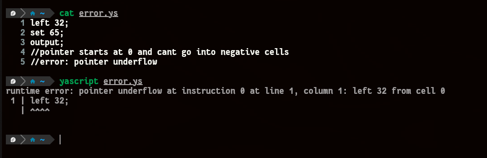

# yascript - Fast, General-Purpose Scripting Language

A fast, optimizing scripting language with a clean Ruby/Python-inspired syntax backed by a high-performance tape VM.

## Features

- **Fast**: Optimized build (`-O3`), computed-goto threaded VM dispatch, optional CPU-specific optimization via `make NATIVE=1`
- **General-Purpose Scripting**: Variables, constants, arithmetic expressions, conditionals, and loops
- **Low-Level Access**: Direct tape manipulation still available (`left`, `rght`, `add`, `goto`, etc.)
- **Smart Diagnostics**: Visual caret error messages pointing to the exact source location
- **Execution Pipeline**:
  1. Tokenization (zero-copy lexer over `string_view`)
  2. Parsing with compile-time symbol table resolution
  3. Multi-pass peephole optimization
  4. Jump-target back-patching
  5. Threaded VM execution (GCC computed-gotos, switch fallback)
  6. Buffered output (4KB)

## Project structure

```
yascript/
├── src/         # Interpreter implementation
├── include/     # Header files
├── examples/    # Example .ys programs
├── tests/       # Test suite
├── docs/        # Design and optimization documentation
├── Makefile     # Build system
└── README.md
```
  
## Install Scripts

 - Install:
```bash
./install.sh
```
 - Uninstall:
```bash
./uninstall.sh
```

# NOTE: Requires: g++ with C++23 support (recent GCC/Clang)

## Usage

### Command-line

Run inline code:
```bash
./yascript -e "let x = 42; print x"
```

Run from a `.ys` file:
```bash
./yascript hello.ys
```

### Scripting Commands (High-Level)

| Syntax                  | Description                                   |
|-------------------------|-----------------------------------------------|
| `let x = expr`          | Declare a variable, optionally initialized    |
| `let x`                 | Declare a variable, initialized to 0          |
| `const N = expr`        | Declare a runtime constant               |
| `x = expr`              | Assign to an existing variable                |
| `print expr`            | Print expression value as a decimal number    |
| `output expr`           | Output expression value as an ASCII character |
| `read x`                | Read one byte from stdin into variable        |
| `if expr ... end`       | Conditional block                             |
| `if expr ... else ... end` | Conditional with else branch              |
| `while expr ... end`    | While loop                                    |

#### Operators (Precedence: high → low)
| Operator | Description              |
|----------|--------------------------|
| `* / %`  | Multiply, divide, modulo |
| `+ -`    | Add, subtract            |
| `== != < <= > >=` | Comparisons       |

### Low-Level Tape Commands

| Command      | Syntax        | Description                              |
|--------------|---------------|------------------------------------------|
| Move left    | `left [N]`    | Move pointer N cells left (default 1)    |
| Move right   | `rght [N]`    | Move pointer N cells right (default 1)   |
| Increment    | `add [N]`     | Add N to current cell (default 1)        |
| Decrement    | `sub [N]`     | Subtract N from current cell (default 1) |
| Set value    | `set N`       | Set current cell to N                    |
| Direct Seek  | `goto TARGET` | Seek tape pointer directly to cell TARGET|
| Output       | `output`      | Output current cell as ASCII             |
| Input        | `read`        | Read one byte to current cell            |
| Print number | `print`       | Output current cell as decimal number    |
| Zero cell    | `zero`        | Set current cell to 0                    |
| Loop start   | `repeat N`    | Start loop, repeat N times               |
| Loop end     | `end`         | End loop block                           |

## Examples

### Hello World (Scripting Style)
```ruby
# Print ASCII 'A' then 'B'
let a = 65
let b = 66
output a
output b
```

### FizzBuzz
```ruby
let i = 1
while i <= 20
    let fizz = i % 3
    let buzz = i % 5
    if fizz == 0
        output 70  # 'F'
        output 105 # 'i'
        output 122 # 'z'
        output 122 # 'z'
    end
    if buzz == 0
        output 66  # 'B'
        output 117 # 'u'
        output 122 # 'z'
        output 122 # 'z'
    end
    if fizz != 0
        if buzz != 0
            print i
        end
    end
    i = i + 1
end
```

### Low-Level (Tape Style)
```yascript
repeat 72 add; end
output;
```



<h2 align="center">Demo</h2>

<p align="center">
  
</p>

## Language Properties

- Tape: Unlimited dynamically-expanding tape (zero-initialized)
- Cells: 64-bit unsigned integers (`uint64_t`)
- Variables: Compile-time tape aliases — zero runtime overhead
- Comments: `#` and `//`
- Extension: `.ys`
- Separators: Newlines or `;` (block statements don't require a separator)

## Building

```bash
make
```

Optional CPU-optimized build:

```bash
make NATIVE=1
```

Run tests:

```bash
make test
```

Install:

```bash
sudo make install
```

Uninstall:

```bash
sudo make uninstall
```

### If you like the project please star it!

## Important
The image ./docs/assets/logo.png was created using generative AI, or the image is AI generated.
